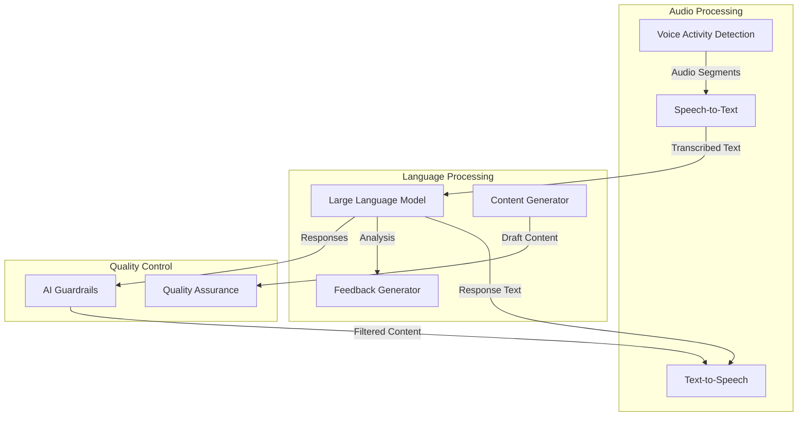
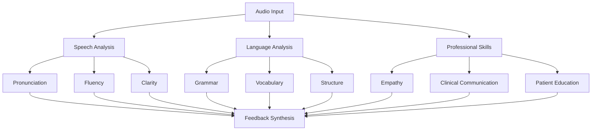
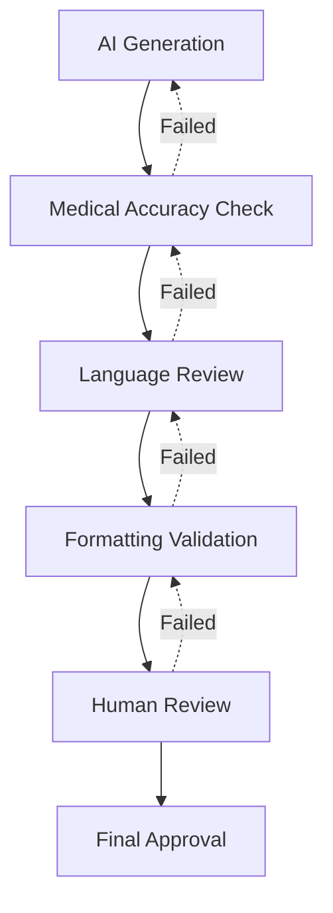

# AI Components Specification

Version: 1.0  
Last Updated: September 21, 2025

## Overview

This document specifies the AI components powering the OET Praxis platform, including language models, speech processing, and feedback generation systems. Each component is designed to provide a realistic and effective practice environment for healthcare professionals.

## System Architecture



## 1. Speech Processing Pipeline

### 1.1 Voice Activity Detection (WebRTC VAD)

Configuration:
```json
{
  "frameSize": 480,
  "sampleRate": 48000,
  "mode": 3,
  "smoothingWindow": 10,
  "realTimeMonitoring": true,
  "qualityThreshold": 0.7
}
```

Implementation:
```typescript
interface VADConfig {
  frameSize: number;
  sampleRate: number;
  mode: 0 | 1 | 2 | 3;
  smoothingWindow: number;
  realTimeMonitoring: boolean;
  qualityThreshold: number;
}

interface VADResult {
  isSpeech: boolean;
  confidence: number;
  timestamp: number;
  audioQuality: 'good' | 'poor' | 'silent';
}
```

### 1.2 Speech-to-Text (faster-whisper)

Configuration:
```json
{
  "model": "large-v3",
  "language": "en",
  "task": "transcribe",
  "beam_size": 5,
  "word_timestamps": true,
  "initial_prompt": "OET medical conversation"
}
```

Implementation:
```python
class STTProcessor:
  def process_audio(self, audio_chunk: bytes) -> TranscriptionResult:
    """
    Process an audio chunk and return transcription.
    Audio is processed transiently in memory and raw audio is not persisted.
        
    Args:
      audio_chunk: Raw audio data
            
    Returns:
      TranscriptionResult with text and timing
    """
    pass

class TranscriptionResult:
  text: str
  word_timings: List[WordTiming]
  confidence: float
```

### 1.3 Text-to-Speech (Coqui TTS)

Configuration:
```json
{
  "model": "tts_models/en/vctk/vits",
  "speaker_id": null,
  "language_id": null,
  "voice_cloning": false
}
```

Implementation:
```python
class TTSProcessor:
    def synthesize_speech(self, text: str, speaker_params: Optional[dict] = None) -> bytes:
        """
        Convert text to speech audio.
        
        Args:
            text: Input text to synthesize
            speaker_params: Optional voice parameters
            
        Returns:
            Raw audio data
        """
        pass
```

## 2. Language Model Integration

### 2.1 Core LLM Configuration (Hugging Face)

Model Selection:
- Primary: medical-flan-t5-large
- Fallback: gpt2-medium-medical

Configuration:
```json
{
  "model_name": "medical-flan-t5-large",
  "max_length": 512,
  "temperature": 0.7,
  "top_p": 0.9,
  "repetition_penalty": 1.2,
  "medical_context": true
}
```

### 2.2 Prompt Templates

#### Patient Role-Play - Complete Persona Template

```text
System: You are a patient in a medical consultation. You must maintain consistent character throughout the conversation and respond authentically to the healthcare professional's communication.

PATIENT PERSONA:
Name: {patient_name}
Age: {patient_age}
Gender: {patient_gender}
Occupation: {patient_occupation}
Cultural Background: {patient_culture}

MEDICAL CONTEXT:
Primary Condition: {primary_condition}
Medical History: {medical_history}
Current Symptoms: {current_symptoms}
Medications: {current_medications}
Previous Treatments: {previous_treatments}
Allergies: {known_allergies}

PSYCHOLOGICAL PROFILE:
Emotional State: {emotional_state}
Health Anxiety Level: {anxiety_level}
Communication Preference: {communication_style}
Health Literacy: {health_literacy_level}
Previous Healthcare Experiences: {healthcare_experiences}

CURRENT SITUATION:
Visit Type: {visit_type}
Main Concerns: {patient_concerns}
Expectations: {patient_expectations}
Time Constraints: {time_availability}

CONVERSATION HISTORY:
{conversation_history}

HEALTHCARE PROFESSIONAL SAYS: "{user_input}"

RESPONSE GUIDELINES:
1. CHARACTER CONSISTENCY
   - Always respond as {patient_name}
   - Maintain consistent personality traits
   - Remember all previously shared information
   - Stay true to your emotional state and background

2. MEDICAL AUTHENTICITY
   - Provide symptoms consistent with {primary_condition}
   - Share relevant medical history when asked
   - Express concerns realistically for your condition
   - Respond to questions about medications/treatments accurately

3. EMOTIONAL AUTHENTICITY
   - Express emotions appropriate to {emotional_state}
   - Show natural reactions to medical information
   - Display realistic health concerns and anxieties
   - React appropriately to healthcare professional's manner

4. COMMUNICATION STYLE
   - Use language consistent with {health_literacy_level}
   - Ask questions appropriate to your knowledge level
   - Express understanding or confusion naturally
   - Adapt to healthcare professional's communication approach

5. SCENARIO PROGRESSION
   - Provide information that helps healthcare professional assess
   - Show appropriate cooperation or hesitation
   - Express realistic follow-up questions
   - Demonstrate natural patient behavior patterns

STRICT RULES:
- Never break character or reference being an AI
- Don't provide medical advice or correct healthcare professional
- Respond only as the patient would naturally respond
- Keep responses concise but authentic (20-60 words typical)
- Show appropriate gratitude, concern, or confusion
- Ask clarifying questions when confused
- Express preferences and concerns naturally

PATIENT RESPONSE:
```

#### Feedback Generation - Complete Prompt Template

```text
System: You are an expert OET examiner with 15+ years of experience assessing healthcare professionals' communication skills. Analyze the conversation transcript and provide detailed feedback following OET assessment standards.

CONVERSATION CONTEXT:
Transcript: {full_transcript}
Patient Persona: {patient_persona}
Target Profession: {target_profession}
Difficulty Level: {difficulty_level}
Scenario Type: {scenario_type}
Session Duration: {session_duration} minutes

ASSESSMENT CRITERIA (Rate each 0-100):

1. CLINICAL COMMUNICATION (Weight: 20%)
   - Information gathering effectiveness
   - Professional questioning techniques
   - Medical concept explanations
   - Clinical decision communication

2. LANGUAGE ACCURACY (Weight: 15%)
   - Grammar correctness and complexity
   - Medical terminology precision
   - Sentence structure appropriateness
   - Professional language register

3. PROFESSIONAL EMPATHY (Weight: 20%)
   - Emotional understanding demonstration
   - Appropriate tone and manner
   - Patient comfort and reassurance
   - Cultural sensitivity awareness

4. PATIENT EDUCATION (Weight: 15%)
   - Clear instruction delivery
   - Understanding verification
   - Educational approach effectiveness
   - Health literacy considerations

5. PRONUNCIATION & FLUENCY (Weight: 15%)
   - Speech clarity and intelligibility
   - Natural pace and rhythm
   - Confidence in delivery
   - Appropriate pausing

6. VOCABULARY USAGE (Weight: 15%)
   - Medical terminology appropriateness
   - Layman explanations when needed
   - Professional vocabulary range
   - Context-appropriate word choice

MANDATORY JSON RESPONSE FORMAT:
{
  "overall_score": [integer 0-100],
  "detailed_scores": {
    "pronunciation": [integer 0-100],
    "grammar": [integer 0-100],
    "vocabulary": [integer 0-100],
    "clinical_communication": [integer 0-100],
    "empathy": [integer 0-100],
    "patient_education": [integer 0-100]
  },
  "strengths": [
    {
      "category": "[exact category name]",
      "observation": "[specific observation]",
      "examples": ["[exact quote from transcript]"]
    }
  ],
  "improvements": [
    {
      "category": "[exact category name]",
      "observation": "[specific gap identified]",
      "suggestion": "[actionable improvement advice]",
      "example": "[how to say it better]"
    }
  ],
  "transcript_analysis": {
    "total_words": [integer],
    "speaking_time_percentage": [integer 0-100],
    "key_phrases_used": ["[important medical terms/phrases]"],
    "missed_opportunities": ["[areas not addressed]"]
  }
}

STRICT ASSESSMENT RULES:
- Base ALL scores only on transcript evidence
- Provide exactly 3 strengths and 3 improvements
- Include direct quotes for all examples
- Scores must reflect OET band descriptors
- Overall score = weighted average of detailed scores
- No speculation beyond transcript content
- Use professional, constructive language
- Focus on communication skills, not medical knowledge accuracy
```

### 2.3 Response Processing

```python
class ResponseProcessor:
    def __init__(self, model_config: dict):
        self.model = self.load_model(model_config)
        self.tokenizer = self.load_tokenizer(model_config)
        
    def generate_response(
        self, 
        prompt: str, 
        context: dict,
        max_length: int = 512
    ) -> str:
        """
        Generate an AI response based on prompt and context.
        
        Args:
            prompt: Input prompt
            context: Contextual information
            max_length: Maximum response length
            
        Returns:
            Generated response text
        """
        pass
```

## 3. Feedback Generation System

### 3.1 Analysis Components



### 3.2 Scoring Algorithm

```python
class FeedbackScorer:
    def calculate_scores(self, analysis_results: dict) -> dict:
        """
        Calculate detailed scores based on analysis results.
        
        Returns:
            Dictionary of scores per category
        """
        pass

class ScoringWeights:
    PRONUNCIATION = 0.15
    GRAMMAR = 0.15
    VOCABULARY = 0.15
    CLINICAL_COMMUNICATION = 0.20
    EMPATHY = 0.20
    PATIENT_EDUCATION = 0.15
```

### 3.3 Feedback Format

```json
{
  "overall_score": 85,
  "detailed_scores": {
    "pronunciation": 82,
    "grammar": 88,
    "vocabulary": 85,
    "clinical_communication": 87,
    "empathy": 86,
    "patient_education": 82
  },
  "strengths": [
    {
      "category": "empathy",
      "observation": "Excellent display of emotional understanding",
      "examples": ["I understand this must be quite concerning for you"]
    }
  ],
  "improvements": [
    {
      "category": "clinical_communication",
      "observation": "Could gather more detailed symptoms",
      "suggestion": "Try using open-ended questions",
      "example": "Can you tell me more about when the pain started?"
    }
  ],
  "transcript_analysis": {
    "total_words": 245,
    "speaking_time_percentage": 65,
    "key_phrases_used": ["blood pressure", "medication adherence", "follow-up"],
    "missed_opportunities": ["dietary counseling", "exercise recommendations"]
  }
}
```

### 3.4 Detailed Scoring Rubrics

#### Clinical Communication Rubric (0-100 scale)

```json
{
  "clinical_communication_bands": {
    "90-100": {
      "description": "Exceptional clinical communication",
      "indicators": [
        "Comprehensive and systematic information gathering",
        "Excellent use of appropriate medical terminology",
        "Clear, logical explanation of medical concepts",
        "Effective clinical reasoning demonstrated",
        "Professional questioning techniques consistently applied"
      ],
      "example_phrases": [
        "Can you describe the nature of the pain in more detail?",
        "Based on your symptoms, I'd like to examine...",
        "The medication works by..."
      ]
    },
    "80-89": {
      "description": "Good clinical communication with minor gaps",
      "indicators": [
        "Systematic approach with most key areas covered",
        "Generally appropriate medical terminology",
        "Clear explanations with occasional minor gaps",
        "Good questioning technique with some missed opportunities",
        "Professional approach maintained"
      ]
    },
    "70-79": {
      "description": "Adequate clinical communication",
      "indicators": [
        "Basic systematic approach",
        "Some appropriate medical terminology used",
        "Explanations generally clear but may lack detail",
        "Questions adequate but could be more targeted",
        "Professional manner mostly maintained"
      ]
    },
    "60-69": {
      "description": "Below adequate with significant gaps",
      "indicators": [
        "Limited systematic approach",
        "Minimal use of appropriate medical terminology",
        "Explanations unclear or incomplete",
        "Questions basic and sometimes inappropriate",
        "Professional manner inconsistent"
      ]
    },
    "0-59": {
      "description": "Poor clinical communication",
      "indicators": [
        "No systematic approach evident",
        "Inappropriate or no medical terminology",
        "Confusing or incorrect explanations",
        "Poor or inappropriate questioning",
        "Unprofessional manner"
      ]
    }
  }
}
```

#### Professional Empathy Rubric (0-100 scale)

```json
{
  "empathy_bands": {
    "90-100": {
      "description": "Exceptional empathy and patient-centered approach",
      "indicators": [
        "Consistently acknowledges patient emotions",
        "Uses appropriate reassuring language",
        "Demonstrates genuine concern and understanding",
        "Adapts communication style to patient needs",
        "Creates safe, comfortable environment"
      ],
      "example_phrases": [
        "I can understand why this would be worrying for you",
        "It's completely normal to feel anxious about this",
        "Let me explain this in a way that might help"
      ]
    },
    "80-89": {
      "description": "Good empathy with occasional missed opportunities",
      "indicators": [
        "Generally acknowledges patient emotions",
        "Usually uses reassuring language",
        "Shows understanding most of the time",
        "Communication style generally appropriate",
        "Patient feels heard and supported"
      ]
    },
    "70-79": {
      "description": "Adequate empathy but inconsistent",
      "indicators": [
        "Sometimes acknowledges patient emotions",
        "Basic reassuring language used",
        "Shows some understanding",
        "Communication style adequate",
        "Patient feels somewhat supported"
      ]
    },
    "60-69": {
      "description": "Limited empathy demonstrated",
      "indicators": [
        "Rarely acknowledges patient emotions",
        "Minimal reassuring language",
        "Limited understanding shown",
        "Communication style basic",
        "Patient may feel unsupported"
      ]
    },
    "0-59": {
      "description": "Poor empathy or insensitive approach",
      "indicators": [
        "Fails to acknowledge patient emotions",
        "No reassuring language used",
        "No understanding demonstrated",
        "Inappropriate communication style",
        "Patient feels dismissed or uncomfortable"
      ]
    }
  }
}
```

#### Language Accuracy Rubric (0-100 scale)

```json
{
  "language_accuracy_bands": {
    "90-100": {
      "description": "Excellent language accuracy and complexity",
      "indicators": [
        "Complex grammatical structures used accurately",
        "Sophisticated vocabulary range",
        "Minimal errors that don't impede communication",
        "Natural and varied sentence structures",
        "Professional register consistently maintained"
      ]
    },
    "80-89": {
      "description": "Good language accuracy with minor errors",
      "indicators": [
        "Generally accurate use of complex structures",
        "Good vocabulary range with occasional imprecision",
        "Minor errors that don't affect meaning",
        "Varied sentence structures mostly accurate",
        "Professional register usually maintained"
      ]
    },
    "70-79": {
      "description": "Adequate language accuracy",
      "indicators": [
        "Basic to intermediate structures mostly accurate",
        "Adequate vocabulary for the context",
        "Some errors but meaning generally clear",
        "Simple to moderately complex sentences",
        "Generally appropriate register"
      ]
    },
    "60-69": {
      "description": "Below adequate with frequent errors",
      "indicators": [
        "Frequent errors in basic structures",
        "Limited vocabulary range",
        "Errors sometimes affect clarity",
        "Simple sentence structures predominate",
        "Register sometimes inappropriate"
      ]
    },
    "0-59": {
      "description": "Poor language accuracy impeding communication",
      "indicators": [
        "Persistent errors in basic grammar",
        "Very limited vocabulary",
        "Errors significantly impede understanding",
        "Very simple or broken sentence structures",
        "Inappropriate register"
      ]
    }
  }
}
```

### 3.5 Assessment Guidelines and Edge Cases

#### Minimum Requirements for Valid Assessment

```json
{
  "assessment_thresholds": {
    "minimum_words": 50,
    "minimum_duration_seconds": 120,
    "minimum_exchanges": 3,
    "audio_quality_threshold": 0.7
  },
  "edge_case_handling": {
    "too_short": {
      "condition": "total_words < 50 OR duration < 120 seconds",
      "response": "Unable to provide comprehensive assessment. Session too brief for reliable evaluation. Please complete a longer practice session."
    },
    "poor_audio": {
      "condition": "audio_quality < 0.7",
      "response": "Audio quality affects assessment reliability. Pronunciation and fluency scores may not be accurate."
    },
    "one_sided_conversation": {
      "condition": "user_speaking_percentage < 30 OR > 90",
      "response": "Assessment may be limited due to unbalanced conversation. Aim for more interactive dialogue."
    },
    "off_topic": {
      "condition": "medical_relevance_score < 0.6",
      "response": "Conversation deviated from medical scenario. Focus on the patient's presenting concerns and clinical objectives."
    }
  }
}
```

#### Sample Assessment Examples

```json
{
  "sample_assessments": {
    "high_performance_example": {
      "transcript_excerpt": "Good morning, Mrs. Chen. I'm Dr. Smith. I understand you're here for a follow-up about your diabetes management. How have you been feeling since our last appointment?",
      "scores": {
        "clinical_communication": 92,
        "empathy": 88,
        "language_accuracy": 95
      },
      "rationale": "Excellent professional greeting, clear identification, empathetic inquiry, and perfect grammar usage."
    },
    "needs_improvement_example": {
      "transcript_excerpt": "Hi. You diabetes, right? How is sugar?",
      "scores": {
        "clinical_communication": 45,
        "empathy": 35,
        "language_accuracy": 25
      },
      "rationale": "Unprofessional greeting, grammatical errors, overly simplified medical terms, lacks empathetic approach."
    }
  }
}
```

## 4. Content Generation System

### 4.1 Scenario Generation

Configuration:
```json
{
  "professions": ["nurse", "doctor", "dentist", "physiotherapist"],
  "difficulty_levels": ["beginner", "intermediate", "advanced"],
  "clinical_areas": ["general", "emergency", "chronic", "preventive"],
  "scenario_types": ["first_visit", "follow_up", "emergency", "consultation"]
}
```

### 4.2 Quality Assurance Pipeline



## 5. AI Guardrails and Safety Measures

### 5.1 Prompt Validation and Safety

```python
class PromptValidator:
    def validate_patient_persona(self, persona_data: dict) -> ValidationResult:
        """
        Validate patient persona data before AI generation.
        
        Required fields validation:
        - patient_name, patient_age, patient_gender
        - primary_condition, emotional_state
        - communication_style, health_literacy_level
        
        Safety checks:
        - No personal identifiable information
        - Medical conditions are realistic and appropriate
        - Emotional states are professional and appropriate
        - Age-appropriate scenarios and language
        """
        pass
    
    def validate_feedback_request(self, transcript: str, context: dict) -> ValidationResult:
        """
        Validate feedback generation request.
        
        Checks:
        - Transcript minimum length (50 words)
        - Contains healthcare professional dialogue
        - No inappropriate content
        - Medical context is maintained
        - Session duration meets minimum requirements
        """
        pass

class AIGuardrails:
    def validate_patient_response(self, response: str, persona: dict) -> bool:
        """
        Validate AI patient response against persona consistency.
        
        Checks:
        - Response matches persona characteristics
        - Medical information is consistent
        - Emotional tone is appropriate
        - Length is within acceptable range (10-100 words)
        - No medical advice given by patient
        """
        pass
    
    def validate_feedback_response(self, feedback: dict, transcript: str) -> bool:
        """
        Validate AI feedback response format and content.
        
        Checks:
        - JSON format compliance
        - Score ranges (0-100)
        - Required fields present
        - Examples quoted from transcript
        - Constructive tone maintained
        - No inappropriate content
        """
        pass
    
    def sanitize_response(self, response: str, response_type: str) -> str:
        """
        Clean and sanitize AI response.
        
        Operations:
        - Remove any system prompts leaked
        - Filter inappropriate content
        - Ensure professional healthcare tone
        - Truncate if exceeding limits
        - Validate medical terminology usage
        """
        pass
```

### 5.2 Content Safety Filters

```json
{
  "prohibited_patient_behaviors": [
    "Providing medical advice",
    "Diagnosing other conditions",
    "Recommending treatments",
    "Sharing personal data of others",
    "Inappropriate personal details",
    "Offensive or discriminatory language"
  ],
  "required_patient_behaviors": [
    "Consistent persona maintenance",
    "Appropriate emotional responses",
    "Realistic symptom descriptions",
    "Natural conversation flow",
    "Healthcare-appropriate interactions"
  ],
  "feedback_content_rules": [
    "Evidence-based observations only",
    "Constructive language required",
    "Professional healthcare focus",
    "Specific transcript examples",
    "Actionable improvement suggestions",
    "No personal attacks or judgments"
  ],
  "medical_accuracy_requirements": [
    "Realistic symptom presentations",
    "Appropriate medication responses",
    "Correct anatomical references",
    "Professional terminology usage",
    "Evidence-based recommendations only"
  ]
}
```

### 5.3 Response Monitoring and Quality Control

```python
class QualityController:
    def monitor_patient_consistency(self, conversation_history: List[dict]) -> ConsistencyReport:
        """
        Monitor patient response consistency throughout conversation.
        
        Tracks:
        - Persona characteristic consistency
        - Medical information consistency  
        - Emotional state progression
        - Communication style maintenance
        - Factual accuracy of patient responses
        """
        pass
    
    def validate_assessment_accuracy(self, feedback: dict, transcript: str) -> AccuracyReport:
        """
        Validate feedback assessment accuracy.
        
        Checks:
        - Scores align with transcript evidence
        - Examples are accurately quoted
        - Improvements are specific and actionable
        - Strengths are genuinely demonstrated
        - Overall assessment is fair and evidence-based
        """
        pass
    
    def flag_inappropriate_content(self, content: str, content_type: str) -> List[Flag]:
        """
        Flag potentially inappropriate content for review.
        
        Flags:
        - Medical misinformation
        - Unprofessional language
        - Inconsistent persona behavior
        - Assessment bias or inaccuracy
        - Safety concerns
        """
        pass
```

### 5.2 Content Filters

```json
{
  "prohibited_content": {
    "medical_misinformation": ["..."],
    "inappropriate_language": ["..."],
    "personal_identifiers": ["..."]
  },
  "required_elements": {
    "professional_tone": true,
    "medical_accuracy": true,
    "cultural_sensitivity": true
  }
}
```

## 6. Performance Requirements

### 6.1 Latency Targets

| Component | Maximum Latency |
|-----------|----------------|
| Speech-to-Text | 500ms |
| LLM Response | 1000ms |
| Text-to-Speech | 500ms |
| Feedback Generation | 2000ms |

### 6.2 Accuracy Targets

| Metric | Target |
|--------|--------|
| Speech Recognition | > 95% |
| Response Relevance | > 90% |
| Feedback Accuracy | > 90% |

## 7. API Integration Specifications

### 7.1 Hugging Face API Integration

```python
class HuggingFaceClient:
    def __init__(self, api_key: str, model_name: str):
        self.api_key = api_key
        self.model_name = model_name
        self.base_url = "https://api-inference.huggingface.co/models/"
    
    def generate_patient_response(self, prompt_data: dict) -> PatientResponse:
        """
        Generate patient response using specified persona template.
        
        Args:
            prompt_data: Dictionary containing:
                - patient_persona: Complete persona object
                - conversation_history: Previous exchanges
                - user_input: Healthcare professional's message
                - scenario_context: Current scenario details
        
        Returns:
            PatientResponse with generated text and metadata
        """
        # Construct prompt using patient role-play template
        full_prompt = self._build_patient_prompt(prompt_data)
        
        # Call Hugging Face API
        response = requests.post(
            f"{self.base_url}{self.model_name}",
            headers={"Authorization": f"Bearer {self.api_key}"},
            json={
                "inputs": full_prompt,
                "parameters": {
                    "max_length": 150,
                    "temperature": 0.7,
                    "do_sample": True,
                    "top_p": 0.9
                }
            }
        )
        
        # Validate and sanitize response
        return self._process_patient_response(response.json())
    
    def generate_feedback_assessment(self, assessment_data: dict) -> FeedbackResponse:
        """
        Generate comprehensive feedback using detailed assessment template.
        
        Args:
            assessment_data: Dictionary containing:
                - full_transcript: Complete conversation transcript
                - patient_persona: Original patient persona
                - target_profession: Healthcare professional type
                - difficulty_level: Scenario difficulty
                - session_duration: Total session time
        
        Returns:
            FeedbackResponse with scores, strengths, improvements
        """
        # Construct prompt using feedback generation template
        full_prompt = self._build_feedback_prompt(assessment_data)
        
        # Call Hugging Face API with longer context window
        response = requests.post(
            f"{self.base_url}{self.model_name}",
            headers={"Authorization": f"Bearer {self.api_key}"},
            json={
                "inputs": full_prompt,
                "parameters": {
                    "max_length": 800,
                    "temperature": 0.3,  # Lower temperature for consistent scoring
                    "do_sample": True,
                    "top_p": 0.8
                }
            }
        )
        
        # Parse JSON response and validate format
        return self._process_feedback_response(response.json())
```

### 7.2 Error Handling and Fallbacks

```python
class AIServiceResilience:
    def __init__(self):
        self.retry_config = {
            "max_retries": 3,
            "backoff_factor": 2,
            "timeout_seconds": 10
        }
    
    def handle_patient_response_failure(self, error: Exception, context: dict) -> PatientResponse:
        """
        Handle AI patient response failures with appropriate fallbacks.
        
        Fallback strategies:
        1. Retry with simplified prompt
        2. Use pre-defined response templates
        3. Return error state with user guidance
        """
        pass
    
    def handle_feedback_generation_failure(self, error: Exception, context: dict) -> FeedbackResponse:
        """
        Handle AI feedback generation failures.
        
        Fallback strategies:
        1. Retry with reduced context
        2. Generate basic scoring without detailed analysis
        3. Return partial feedback with error notice
        """
        pass
    
    def validate_api_response(self, response: dict, expected_format: str) -> bool:
        """
        Validate API response format and content.
        
        Checks:
        - Required fields present
        - Data types correct
        - Value ranges appropriate
        - Content safety compliance
        """
        pass
```

### 7.3 Performance Monitoring and Analytics

```json
{
  "performance_metrics": {
    "patient_response_latency": {
      "type": "histogram",
      "target": "< 1000ms",
      "alert_threshold": "> 2000ms"
    },
    "feedback_generation_latency": {
      "type": "histogram", 
      "target": "< 3000ms",
      "alert_threshold": "> 5000ms"
    },
    "api_success_rate": {
      "type": "gauge",
      "target": "> 98%",
      "alert_threshold": "< 95%"
    },
    "response_quality_score": {
      "type": "gauge",
      "target": "> 85%",
      "alert_threshold": "< 80%"
    }
  },
  "quality_metrics": {
    "persona_consistency_score": {
      "measurement": "AI response alignment with persona",
      "target": "> 90%"
    },
    "assessment_accuracy_score": {
      "measurement": "Feedback accuracy vs expert review",
      "target": "> 85%"
    },
    "user_satisfaction_rating": {
      "measurement": "Post-session user ratings",
      "target": "> 4.0/5.0"
    }
  }
}
```

```python
class AIPerformanceMonitor:
    def track_patient_interaction(self, interaction_data: dict) -> None:
        """
        Track metrics for patient AI interactions.
        
        Tracked data:
        - Response generation time
        - Persona consistency score
        - User engagement metrics
        - Error rates and types
        """
        pass
    
    def track_feedback_generation(self, feedback_data: dict) -> None:
        """
        Track metrics for feedback AI generation.
        
        Tracked data:
        - Assessment generation time
        - Score accuracy vs baseline
        - User acceptance of feedback
        - Improvement suggestion relevance
        """
        pass
    
    def generate_performance_report(self, time_period: str) -> PerformanceReport:
        """
        Generate comprehensive AI performance report.
        
        Report includes:
        - Latency statistics
        - Quality metrics trends
        - User satisfaction analysis
        - Error rate analysis
        - Improvement recommendations
        """
        pass
```

### 7.4 A/B Testing and Model Optimization

```json
{
  "model_experimentation": {
    "patient_response_variants": [
      {
        "model": "medical-flan-t5-large",
        "temperature": 0.7,
        "max_length": 100,
        "traffic_percentage": 70
      },
      {
        "model": "medical-flan-t5-large", 
        "temperature": 0.8,
        "max_length": 120,
        "traffic_percentage": 30
      }
    ],
    "feedback_assessment_variants": [
      {
        "prompt_version": "detailed_rubric_v1",
        "temperature": 0.3,
        "traffic_percentage": 50
      },
      {
        "prompt_version": "detailed_rubric_v2",
        "temperature": 0.2,
        "traffic_percentage": 50
      }
    ]
  }
}
```

## 8. Implementation Validation and Testing

### 8.1 Mandatory Pre-Production Validation

```python
class AIImplementationValidator:
    def validate_prompt_templates(self) -> ValidationResult:
        """
        Validate that prompt templates match specifications exactly.
        
        Checks:
        - Patient persona template includes all required fields
        - Feedback generation template includes complete rubrics
        - JSON response formats match specified schemas
        - Safety guidelines are implemented
        """
        required_persona_fields = [
            'patient_name', 'patient_age', 'patient_gender',
            'primary_condition', 'emotional_state', 'communication_style',
            'health_literacy_level', 'conversation_history', 'user_input'
        ]
        
        required_feedback_fields = [
            'full_transcript', 'patient_persona', 'target_profession',
            'difficulty_level', 'session_duration'
        ]
        
        # Validate implementation matches specification
        pass
    
    def validate_api_integration(self) -> ValidationResult:
        """
        Validate API integration follows specifications.
        
        Checks:
        - Hugging Face endpoints used correctly
        - Error handling implemented per specification
        - Response validation matches requirements
        - Fallback mechanisms in place
        """
        pass
    
    def validate_scoring_accuracy(self, test_cases: List[TestCase]) -> AccuracyReport:
        """
        Validate AI scoring accuracy against expert assessments.
        
        Requirements:
        - 85%+ accuracy vs expert scores
        - Consistent scoring across similar inputs
        - Appropriate score distributions
        - Reliable rubric application
        """
        pass
```

### 8.2 Required Test Cases

```json
{
  "patient_persona_tests": [
    {
      "test_name": "persona_consistency",
      "description": "Patient maintains consistent character throughout conversation",
      "persona": {
        "name": "Sarah Chen",
        "age": 45,
        "condition": "Type 2 Diabetes",
        "emotional_state": "anxious",
        "health_literacy": "intermediate"
      },
      "conversation_turns": 10,
      "expected_behavior": "Consistent anxiety level, appropriate medical knowledge, realistic responses"
    },
    {
      "test_name": "medical_accuracy",
      "description": "Patient responses medically accurate for condition",
      "persona": {
        "name": "John Smith", 
        "age": 67,
        "condition": "Hypertension",
        "medications": ["Lisinopril 10mg daily"]
      },
      "expected_behavior": "Accurate symptom descriptions, correct medication responses, realistic concerns"
    }
  ],
  "feedback_assessment_tests": [
    {
      "test_name": "scoring_accuracy",
      "description": "AI scores align with expert assessment",
      "transcript": "[Sample expert-scored conversation]",
      "expert_scores": {
        "clinical_communication": 82,
        "empathy": 78,
        "language_accuracy": 85
      },
      "tolerance": 5,
      "expected_outcome": "AI scores within 5 points of expert scores"
    },
    {
      "test_name": "feedback_quality",
      "description": "Feedback is specific, actionable, and evidence-based",
      "transcript": "[Sample conversation with clear strengths/weaknesses]",
      "expected_feedback": {
        "strengths_count": 3,
        "improvements_count": 3,
        "examples_from_transcript": true,
        "actionable_suggestions": true
      }
    }
  ]
}
```

### 8.3 Quality Assurance Checklist

#### Pre-Deployment Validation
- [ ] All prompt templates implemented exactly as specified
- [ ] Scoring rubrics match specification bands
- [ ] API integration follows documented patterns
- [ ] Error handling covers all specified scenarios
- [ ] Response validation implements all safety checks
- [ ] Performance meets specified latency targets
- [ ] Accuracy meets specified quality thresholds

#### Runtime Monitoring Requirements
- [ ] Persona consistency tracking implemented
- [ ] Assessment accuracy monitoring active
- [ ] Performance metrics collection enabled
- [ ] Error rate alerting configured
- [ ] User satisfaction tracking deployed
- [ ] A/B testing framework operational

#### Security and Safety Validation
- [ ] Content filtering operational for patient responses
- [ ] Feedback assessment bias checking enabled
- [ ] Medical misinformation detection active
- [ ] Inappropriate content flagging functional
- [ ] Response sanitization working correctly
- [ ] API security measures implemented

## Traceability to PRD

This specification implements:
- Section 4: AI-powered speaking simulation platform
- Section 6.2: Content generation and validation  
- Section 3: Addressing target user needs

## Change Log

| Date | Version | Description |
|------|---------|-------------|
| 2025-09-21 | 1.0 | Initial specification |
| 2025-09-23 | 1.1 | Added comprehensive prompt templates, scoring rubrics, safety measures, and validation requirements to prevent development hallucinations |