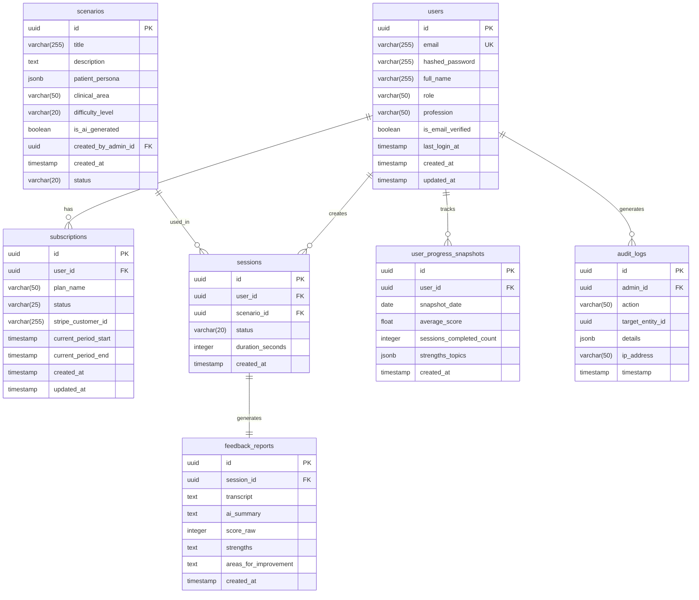

# Database Schema Specification

Version: 1.0  
Last Updated: September 21, 2025

## Overview

This document defines the complete database schema for the OET Praxis platform. The schema is designed to support all core functionalities while maintaining data integrity, performance, and scalability.

## Entity Relationship Diagram

## Table Specifications

### users
Primary user account table storing both standard users and administrators.

| Column | Type | Constraints | Description |
|--------|------|-------------|-------------|
| id | UUID | PK, NOT NULL | Unique identifier |
| email | VARCHAR(255) | UNIQUE, NOT NULL | User's email address |
| hashed_password | VARCHAR(255) | NOT NULL | Securely hashed password |
| full_name | VARCHAR(255) | NULL | User's full name |
| role | VARCHAR(50) | NOT NULL | 'user' or 'admin' |
| profession | VARCHAR(50) | NULL | Healthcare profession |
| is_email_verified | BOOLEAN | NOT NULL, DEFAULT false | Email verification status |
| last_login_at | TIMESTAMP | NULL | Last successful login |
| created_at | TIMESTAMP | NOT NULL | Account creation timestamp |
| updated_at | TIMESTAMP | NOT NULL | Last update timestamp |

Indexes:
- PRIMARY KEY (id)
- UNIQUE INDEX (email)
- INDEX (role)

### subscriptions
Manages user subscription status and billing information.

| Column | Type | Constraints | Description |
|--------|------|-------------|-------------|
| id | UUID | PK, NOT NULL | Unique identifier |
| user_id | UUID | FK, NOT NULL | Reference to users.id |
| plan_name | VARCHAR(50) | NOT NULL | Subscription plan identifier |
| status | VARCHAR(25) | NOT NULL | Subscription status |
| stripe_customer_id | VARCHAR(255) | NULL | External payment processor ID |
| current_period_start | TIMESTAMP | NOT NULL | Start of billing cycle |
| current_period_end | TIMESTAMP | NOT NULL | End of billing cycle |
| created_at | TIMESTAMP | NOT NULL | Record creation timestamp |
| updated_at | TIMESTAMP | NOT NULL | Last update timestamp |

Indexes:
- PRIMARY KEY (id)
- FOREIGN KEY (user_id) REFERENCES users(id)
- INDEX (status)
- INDEX (current_period_end)

### scenarios
Stores practice scenarios for OET speaking tests.

| Column | Type | Constraints | Description |
|--------|------|-------------|-------------|
| id | UUID | PK, NOT NULL | Unique identifier |
| title | VARCHAR(255) | NOT NULL | Scenario title |
| description | TEXT | NOT NULL | Detailed scenario description |
| patient_persona | JSONB | NOT NULL | Structured patient details |
| clinical_area | VARCHAR(50) | NOT NULL | Medical specialty area |
| target_profession | VARCHAR(50) | NOT NULL | Specific profession (doctor, nurse, dentist, physiotherapist) |
| difficulty_level | VARCHAR(20) | NOT NULL | Scenario difficulty |
| is_ai_generated | BOOLEAN | NOT NULL, DEFAULT false | AI generation flag |
| created_by_admin_id | UUID | FK, NOT NULL | Reference to users.id |
| created_at | TIMESTAMP | NOT NULL | Creation timestamp |
| status | VARCHAR(20) | NOT NULL | Publication status |

Indexes:
- PRIMARY KEY (id)
- FOREIGN KEY (created_by_admin_id) REFERENCES users(id)
- INDEX (target_profession, difficulty_level)
- INDEX (target_profession, clinical_area)
- INDEX (status)

### sessions
Records individual practice sessions.

| Column | Type | Constraints | Description |
|--------|------|-------------|-------------|
| id | UUID | PK, NOT NULL | Unique identifier |
| user_id | UUID | FK, NOT NULL | Reference to users.id |
| scenario_id | UUID | FK, NOT NULL | Reference to scenarios.id |
| status | VARCHAR(20) | NOT NULL | Session status |
| (no audio stored) | | | Audio is processed transiently; only transcripts are stored in `feedback_reports` |
| duration_seconds | INTEGER | NULL | Session duration |
| created_at | TIMESTAMP | NOT NULL | Session timestamp |

Indexes:
- PRIMARY KEY (id)
- FOREIGN KEY (user_id) REFERENCES users(id)
- FOREIGN KEY (scenario_id) REFERENCES scenarios(id)
- INDEX (created_at)
- INDEX (status)

### feedback_reports
Stores AI-generated feedback for practice sessions.

| Column | Type | Constraints | Description |
|--------|------|-------------|-------------|
| id | UUID | PK, NOT NULL | Unique identifier |
| session_id | UUID | FK, NOT NULL | Reference to sessions.id |
| transcript | TEXT | NOT NULL | Session transcript |
| ai_summary | TEXT | NOT NULL | Overall session summary |
| score_raw | INTEGER | NOT NULL | Numerical score |
| strengths | TEXT | NOT NULL | Positive feedback |
| areas_for_improvement | TEXT | NOT NULL | Improvement suggestions |
| created_at | TIMESTAMP | NOT NULL | Creation timestamp |

Indexes:
- PRIMARY KEY (id)
- FOREIGN KEY (session_id) REFERENCES sessions(id)
- INDEX (score_raw)

### user_progress_snapshots
Tracks user progress over time for analytics.

| Column | Type | Constraints | Description |
|--------|------|-------------|-------------|
| id | UUID | PK, NOT NULL | Unique identifier |
| user_id | UUID | FK, NOT NULL | Reference to users.id |
| snapshot_date | DATE | NOT NULL | Progress snapshot date |
| average_score | FLOAT | NOT NULL | Average session score |
| sessions_completed_count | INTEGER | NOT NULL | Total completed sessions |
| strengths_topics | JSONB | NOT NULL | Areas of proficiency |
| created_at | TIMESTAMP | NOT NULL | Creation timestamp |

Indexes:
- PRIMARY KEY (id)
- FOREIGN KEY (user_id) REFERENCES users(id)
- INDEX (snapshot_date)
- INDEX (user_id, snapshot_date)

### audit_logs
Maintains security audit trail for administrative actions.

| Column | Type | Constraints | Description |
|--------|------|-------------|-------------|
| id | UUID | PK, NOT NULL | Unique identifier |
| admin_id | UUID | FK, NOT NULL | Reference to users.id |
| action | VARCHAR(50) | NOT NULL | Action performed |
| target_entity_id | UUID | NULL | Affected entity ID |
| details | JSONB | NULL | Action details |
| ip_address | VARCHAR(50) | NOT NULL | Admin IP address |
| timestamp | TIMESTAMP | NOT NULL | Action timestamp |

Indexes:
- PRIMARY KEY (id)
- FOREIGN KEY (admin_id) REFERENCES users(id)
- INDEX (timestamp)
- INDEX (action)

## Data Types and Conventions

### UUID Generation
- All primary keys use UUID v4
- Generated using database native UUID functions

### Timestamps
- All timestamps stored in UTC
- Default precision: microseconds
- Created/updated timestamps handled by triggers

### JSON/JSONB Fields
- Used for flexible, structured data
- Schema validation using database constraints
- Indexed using GIN for efficient querying

## Data Integrity Rules

### Cascading Deletes
- No physical deletes for core entities
- Soft deletion using status fields
- Audit logs never deleted

### Foreign Key Constraints
- ON DELETE RESTRICT for most relations
- ON DELETE CASCADE for certain child records
- Deferred constraints where necessary

### Unique Constraints
- Case-insensitive email uniqueness
- Composite uniqueness where applicable

## Traceability to PRD

This schema supports:
- Section 6.2: Content Strategy (scenarios table)
- Section 7: Monetization Model (subscriptions table)
- User Progress Tracking (sessions, feedback_reports tables)
- Administrative Controls (audit_logs table)

## Change Log

| Date | Version | Description |
|------|---------|-------------|
| 2025-09-21 | 1.0 | Initial schema specification |