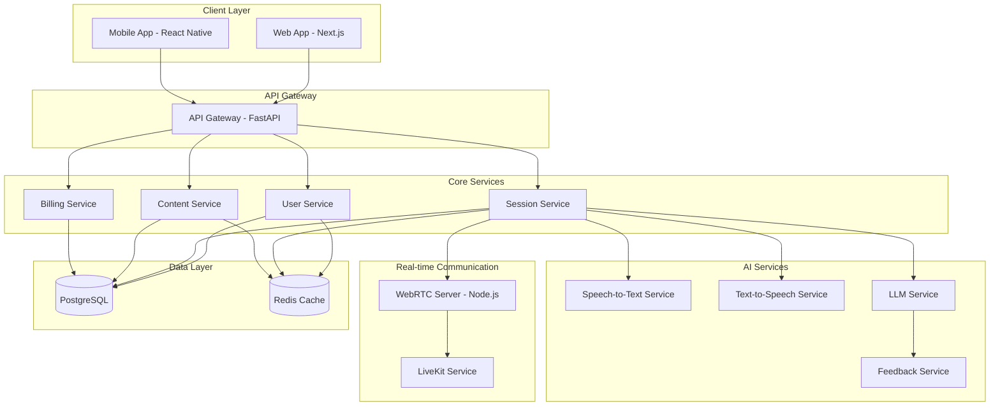

# System Architecture Specification

Version: 1.0  
Last Updated: September 21, 2025

## Overview

OET Praxis is built on a modern, scalable microservices architecture designed to handle real-time audio processing, AI-powered conversations, and comprehensive user management. This document details the system's technical architecture and implementation specifications.

## System Architecture Diagram

## Technology Stack

### Frontend Layer
1. Web Application
   - Framework: Next.js
   - UI Components: shadcn/ui + Tailwind CSS
   - State Management: Zustand
   - API Management: TanStack Query (React Query)
   - Real-time Communication: WebRTC
   - Forms: React Hook Form
   - Charts: Recharts
   - Animations: Framer Motion
   - Testing: Jest, React Testing Library

2. Mobile Application
   - Framework: React Native
   - UI Components: NativeBase (compatible with Tailwind design tokens)
   - State Management: Zustand
   - API Management: TanStack Query (React Query)
   - Navigation: React Navigation
   - Testing: Jest, React Native Testing Library

### Backend Layer
1. API Gateway & Core Services
   - Framework: FastAPI
   - Authentication: JWT
   - API Documentation: OpenAPI (Swagger)
   - Testing: pytest

2. WebRTC Server
   - Runtime: Node.js
   - WebRTC Platform: LiveKit
   - Testing: Jest

### AI Services
1. Speech Processing
   - Speech-to-Text: faster-whisper
   - Text-to-Speech: Coqui TTS
   - Audio Processing: WebRTC VAD
   - Note: Audio is processed in-memory/transiently and is not persisted. Only transcriptions (text) and derived feedback are stored.

2. Language Models
   - Primary LLM: Hugging Face
   - Feedback Generation: Custom fine-tuned model
   - Embeddings: sentence-transformers

### Data Layer
1. Primary Database
   - PostgreSQL 15+
   - Extensions: pgvector for embeddings

2. Caching Layer
   - Redis 7+
   - Use Cases: Session state, API caching

## Service Specifications

### 1. API Gateway
- Handles authentication and authorization
- Routes requests to appropriate microservices
- Rate limiting and request validation
- API versioning
- Request/response logging

### 2. User Service
- User registration and authentication
- Profile management
- Role-based access control
- Session management

### 3. Session Service
- Practice session orchestration
- Real-time audio processing
- AI interaction management
- Progress tracking

### 4. Content Service
- Scenario management
- Content versioning
- Admin content tools
- Content delivery

### 5. Billing Service
- Subscription management
- Payment processing
- Usage tracking
- Invoice generation

## Security Specifications

### Authentication
1. JWT-based authentication
2. Refresh token rotation
3. Multi-factor authentication for admin users

### Data Protection
1. End-to-end encryption for audio streams
2. At-rest encryption for stored data
3. Data retention policies

### Compliance
1. GDPR compliance measures
2. HIPAA compliance considerations
3. Data privacy controls

## Monitoring and Observability

### Metrics Collection
1. Service health metrics
2. Performance metrics
3. Business metrics

### Logging
1. Centralized logging
2. Error tracking
3. Audit logging

### Alerting
1. Service availability alerts
2. Error rate thresholds
3. Performance degradation alerts

## Deployment Architecture

### Development Environment
- Docker-based local development
- Development database seeding
- Hot reloading configuration

### Staging Environment
- Kubernetes deployment
- Automated testing
- Performance testing

### Production Environment
- Multi-region deployment
- Auto-scaling configuration
- Disaster recovery setup

## Integration Points

### Third-party Services
1. LiveKit
   - WebRTC infrastructure
   - Real-time communication

2. Hugging Face
   - LLM hosting
   - Model deployment

3. Stripe
   - Payment processing
   - Subscription management

## Performance Requirements

### Latency Targets
- API Response Time: < 200ms
- Audio Processing: < 100ms
- LLM Response: < 2s

### Scalability Targets
- Concurrent Users: 10,000+
- Active Sessions: 1,000+
- Daily Active Users: 50,000+

## Traceability to PRD

This architecture directly addresses the following PRD requirements:
- Section 4 (Solution Overview): Microservices architecture enables the comprehensive platform
- Section 6.1 (User Journey): Real-time processing supports smooth user experience
- Section 6.2 (Content Strategy): Content service enables scenario management
- Section 7 (Monetization): Billing service supports freemium model

## Change Log

| Date | Version | Description |
|------|---------|-------------|
| 2025-09-21 | 1.0 | Initial specification |