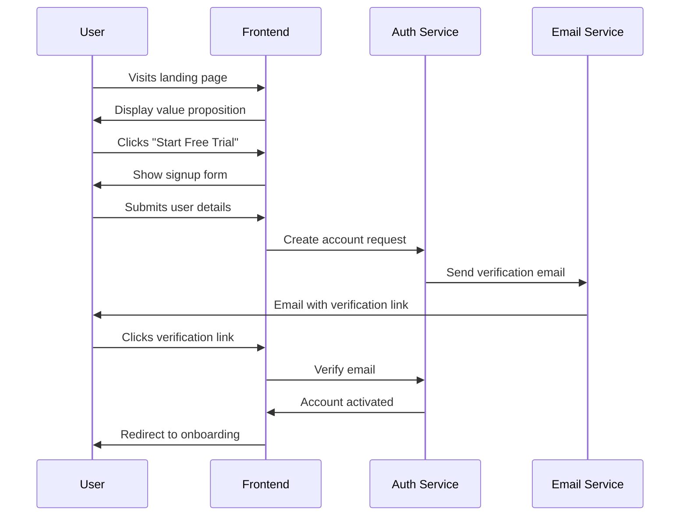
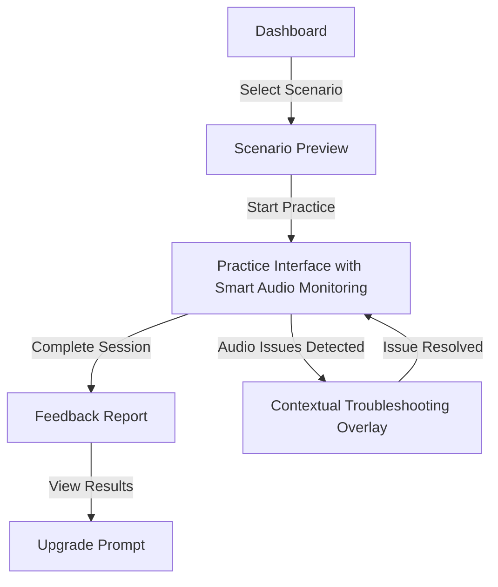
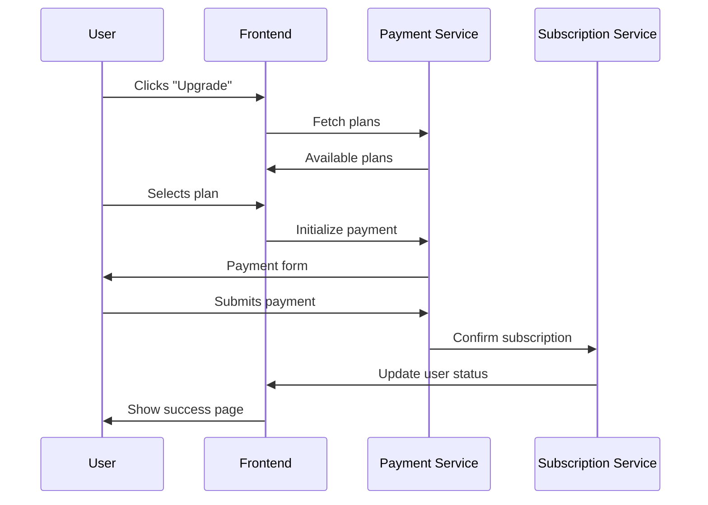
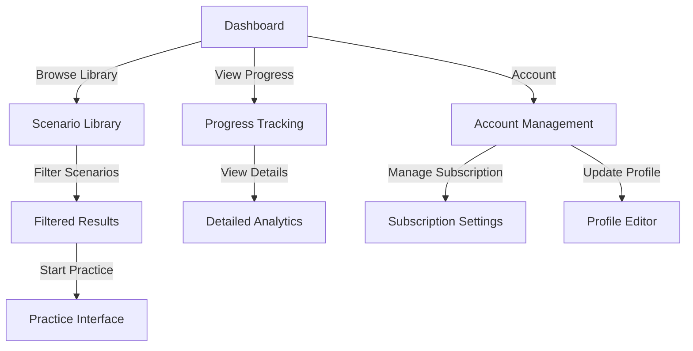
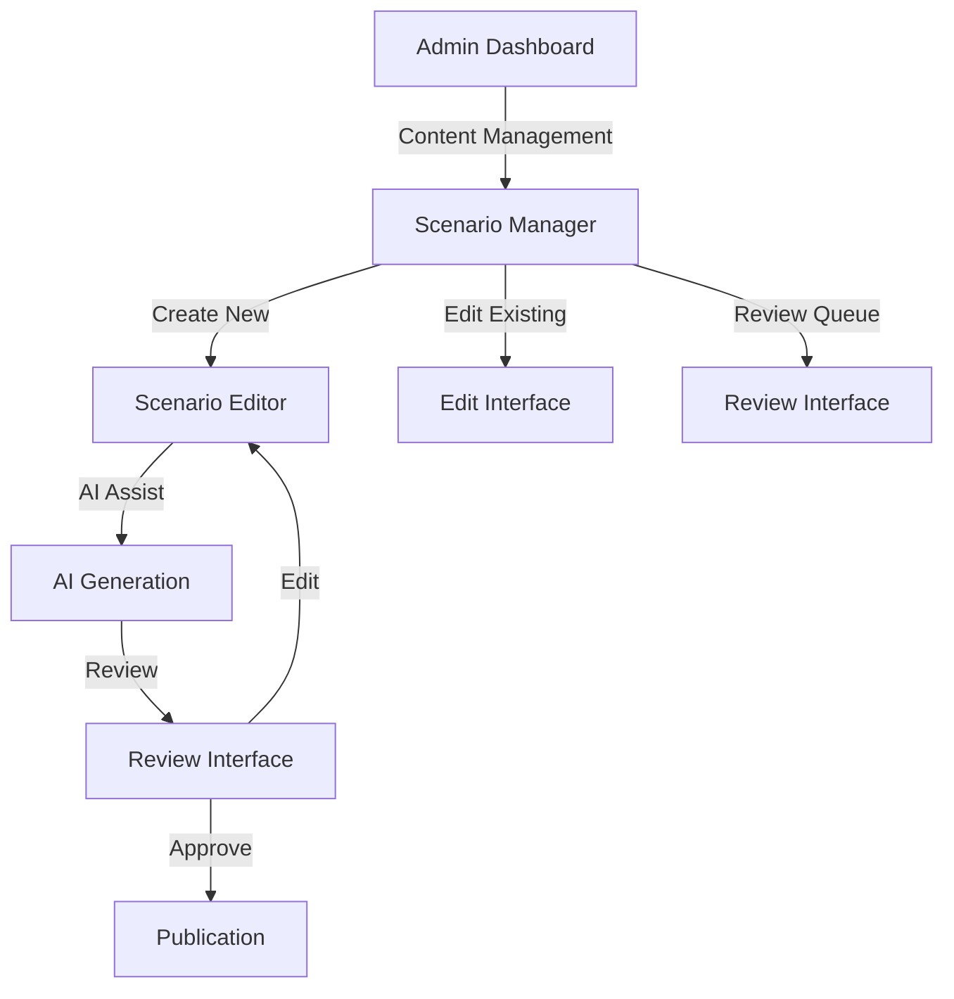
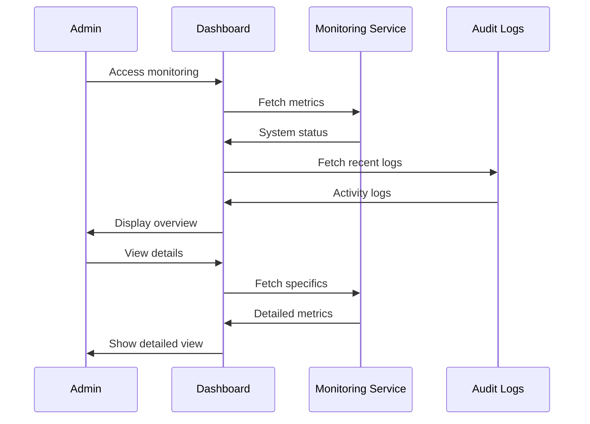

# User Journeys Specification

Version: 1.0  
Last Updated: September 21, 2025

## Overview

This document specifies the complete user journeys for the OET Praxis platform, detailing the interactions, screens, and flows for each user type. All journeys are designed to optimize for the platform's core value proposition while maintaining simplicity and clarity.

## User Types

1. Free Trial User
2. Paid Subscriber
3. Administrator

## 1. Free Trial User Journey

### 1.1 Discovery and Signup Flow

#### Required Information
- Email address
- Password (8+ characters, 1 uppercase, 1 number)
- Full name
- Healthcare profession
- Agreement to terms of service

### 1.2 First Practice Session

#### Key Interactions
1. Scenario Selection
   - Auto-filtered to user's specific profession (doctor, nurse, dentist, physiotherapist)
   - Only profession-relevant scenarios displayed
   - Difficulty clearly marked
   - Expected duration shown

2. Practice Interface
   - Clear role-play instructions
   - Audio recording indicators with smart monitoring
   - Real-time audio quality detection
   - Time tracking
   - Emergency stop option
   - Contextual audio troubleshooting when needed

3. Feedback Report
   - Overall score
   - Detailed breakdown
   - Improvement suggestions
   - Sample correct responses

## 2. Paid Subscriber Journey

### 2.1 Subscription Flow

#### Subscription Options
1. Monthly Plan
   - Instant access
   - Cancel anytime
   - All features included

2. Annual Plan
   - 20% discount
   - Instant access
   - All features included

### 2.2 Advanced Practice Features

#### Available Features
1. Scenario Library
   - Profession-specific content only
   - Advanced filters (difficulty, clinical area, duration)
   - Difficulty progression tracking
   - Practice history for user's profession

2. Progress Tracking
   - Score trends
   - Improvement areas
   - Practice frequency

3. Account Management
   - Subscription status
   - Payment history
   - Profile settings
   - Notification preferences

## 3. Administrator Journey

### 3.1 Content Management

#### Content Management Features
1. Scenario Creation
   - AI-assisted generation
   - Template system
   - Medical accuracy check
   - Format validation

2. Review Process
   - Quality checklist
   - Medical review
   - Language review
   - Final approval

### 3.2 System Monitoring

#### Monitoring Features
1. System Health
   - Service status
   - Error rates
   - Performance metrics
   - Capacity utilization

2. User Analytics
   - Active users
   - Session completion rates
   - Conversion metrics
   - Retention data

3. Content Analytics
   - Popular scenarios
   - Difficulty distribution
   - Completion rates
   - Feedback effectiveness

## UI/UX Guidelines

### 1. Navigation Structure
- shadcn/ui Navigation Menu component
- Consistent breadcrumbs using Breadcrumb component  
- Logical grouping with Card containers
- Quick actions via Command palette

### 2. Error Handling
- Alert components for clear error messages
- Toast notifications for user feedback
- Recovery instructions in Dialog components
- Automatic error reporting via form validation

### 3. Loading States
- Skeleton components for content loading
- Spinner animations for processing states
- Progress components for long operations
- Background operations with Toast updates

### 4. Responsive Design
- Mobile-first Tailwind CSS approach
- Touch-friendly Button components (min 48px)
- Responsive Grid and Flex layouts
- Adaptive Sheet components for mobile navigation

## Accessibility Requirements

1. WCAG 2.1 Compliance
   - Color contrast
   - Keyboard navigation
   - Screen reader support
   - Focus management

2. Audio Alternatives
   - Captions
   - Transcripts
   - Visual indicators
   - Volume controls

## Performance Targets

1. Page Load Times
   - First contentful paint: < 1.5s
   - Time to interactive: < 2s
   - Full page load: < 3s

2. Interactive Features
   - Button response: < 100ms
   - Form submission: < 500ms
   - Audio processing: < 1s
   - Feedback generation: < 3s

## Traceability to PRD

These user journeys directly implement:
- Section 6.1: User Journey specifications
- Section 6.2: Content Strategy implementation
- Section 7: Monetization Model execution

## Change Log

| Date | Version | Description |
|------|---------|-------------|
| 2025-09-21 | 1.0 | Initial specification |